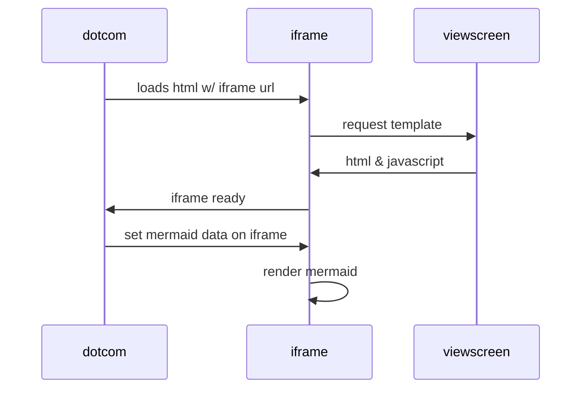

# CosmosDB and Functions 


## Console app

https://pmichaels.net/di-console-app/


## Things to try

	- Console with DI to do things like send queue messages
	- Functions app to update CosmosDB (emulated)
		- command line reference - https://learn.microsoft.com/en-us/azure/cosmos-db/emulator-command-line-parameters#manage-the-emulator-with-command-line-syntax
			Import-Module "$env:ProgramFiles\Azure Cosmos DB Emulator\PSModules\Microsoft.Azure.CosmosDB.Emulator"
			
		- add event grid and servicebus later
	- Razor app to get data from Cosmos
	- README with mermaid diagram

 - Maths
	https://github.blog/2022-05-19-math-support-in-markdown/

    When $a \ne 0$, there are two solutions to $(ax^2 + bx + c = 0)$ and they are $$ x = {-b \pm \sqrt{b^2-4ac} \over 2a} $$

 - Mermaid
   - https://github.blog/2022-02-14-include-diagrams-markdown-files-mermaid/

    ```mermaid
      graph TD;
          A-->B;
          A-->C;
          B-->D;
          C-->D;
    ```
 


 

